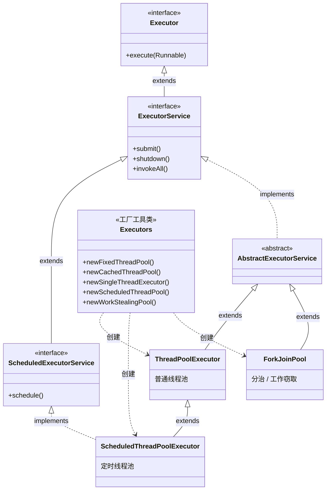

# Java 并发面试知识总结

> 主线：为什么要池化线程 → 线程池怎么用怎么调 → 并发的三大底层（可见性/原子性/有序性）→ 锁（synchronized / AQS / 各种锁）→ 并发容器与工具。
> 每个点按"问题 → 方案 → 为什么 → 坑"往下挖。风格沿用中间件系列：先类比建直觉，术语给中英文 + 说明（如"偏向锁（Biased Lock）"）。

---

## 一、为什么要线程池（解决什么问题）

直接 `new Thread()` 来一个任务开一个线程，有三个问题：
1. **创建/销毁线程开销大**：线程是操作系统资源，创建要分配栈、内核态切换，销毁也要回收，频繁开关很浪费。
2. **资源不可控**：来多少任务开多少线程，瞬间几万个线程 → 内存爆、CPU 全耗在线程切换上 → 系统崩。
3. **不好管理**：没法统一控制并发数、没法复用、没法监控。

**线程池的核心思想是"池化"**：预先创建一批线程**反复复用**，任务来了交给空闲线程干、干完线程不销毁而是回来等下一个；同时**控制线程总数**，多出来的任务排队或拒绝。

**类比**：线程池像一家**餐厅**——不是每来一桌客人就现招一个服务员（new Thread）、客人走了就辞退；而是雇一批固定服务员（核心线程）循环服务，高峰再临时加人（最大线程），人手实在不够就让客人等位（队列）或婉拒（拒绝策略）。

---

## 二、线程池

### 1. ThreadPoolExecutor：所有线程池的底座

Java 线程池**底层只有一个真正的实现 `ThreadPoolExecutor`**，平时说的"几种线程池"都是它用不同参数预设出来的。所以先吃透它的 **7 个参数**（对应餐厅的配置）：

| 参数 | 含义 | 餐厅类比 |
|---|---|---|
| `corePoolSize` | 核心线程数 | 常驻服务员 |
| `maximumPoolSize` | 最大线程数 | 加上临时工的上限 |
| `keepAliveTime` | 空闲线程存活时间 | 临时工闲多久就辞退 |
| `unit` | 上面时间的单位 | —— |
| `workQueue` | 任务队列 | 门口等位区 |
| `threadFactory` | 线程工厂（怎么造线程，可命名） | 招人的渠道 |
| `handler` | 拒绝策略 | 满了怎么打发客人 |

**任务提交后的处理顺序（关键，必考）**：
```
来一个任务：
① 核心线程没满 → 开一个核心线程干（哪怕有空闲核心线程？不，先看是否达到core，没达到就新建）
② 核心线程满了 → 任务进【队列】排队
③ 队列也满了 → 开临时线程干（直到 maximumPoolSize）
④ 到最大线程数、队列还满 → 触发【拒绝策略】
```
记成：**先占常驻服务员 → 再去等位区排队 → 还不够才加临时工 → 全满了才拒客**。
（注意一个反直觉点：队列没满之前**不会**开临时线程——也就是说 `maximumPoolSize` 只有在队列满了之后才起作用。所以如果用了**无界队列**，队列永远不会满，`maximumPoolSize` 形同虚设。）

**线程是怎么"复用"的（核心原理，很多人答不上来）**：线程池的线程不是"干完一个任务就结束"。每个工作线程（源码里叫 `Worker`）内部是一个 **`while` 循环**：干完手里的任务后，**不退出，而是去任务队列里 `take()` 取下一个任务**；队列空了就**阻塞在 `take()` 上**（睡着、不占 CPU），有新任务进队列就被唤醒继续干。这就是"复用"的本质——**线程的生命周期和任务解绑，一个线程循环着处理无数个任务**。
- 核心线程默认一直阻塞等任务、不销毁；
- 非核心线程（临时工）取任务时用**带超时的 `poll(keepAliveTime)`**，超过空闲时间还没等到任务，循环就结束、线程销毁——这就是 `keepAliveTime` 的实现。

**execute() 的源码逻辑**（和上面流程对应，知道它怎么判断的）：用一个 `ctl` 变量同时存"线程池状态 + 线程数"（高 3 位状态、低 29 位线程数，省一个字段）。提交任务时：
1. 当前线程数 < 核心数 → `addWorker` 加核心线程执行；
2. 否则 `workQueue.offer(task)` 尝试入队；入队成功再**复查一次**池是否还在运行（万一刚好被关闭，要回滚移除任务并拒绝）；
3. 入队失败（队列满）→ `addWorker` 加非核心线程；加失败（到 maximumPoolSize）→ `reject` 拒绝。

**线程池的 5 种状态**（了解）：`RUNNING`（正常收任务）→ `SHUTDOWN`（`shutdown()`：不收新任务、把存量做完）→ `STOP`（`shutdownNow()`：不收新任务、丢弃队列、中断正在执行的）→ `TIDYING`（都终止了、即将收尾）→ `TERMINATED`（彻底结束）。`shutdown()` 优雅、`shutdownNow()` 强硬，区别常被问。

**submit() vs execute()**：`execute(Runnable)` 提交不关心返回、异常直接抛出；`submit(...)` 返回一个 `Future`，能拿结果、**但任务里抛的异常会被包在 Future 里**——不调用 `future.get()` 就**看不到异常**（任务静默失败），这是个常见的坑。

### 2. Executors 工厂的几种线程池

`Executors` 工厂方法是 `ThreadPoolExecutor` 的快捷预设：

| 线程池 | 参数特点 | 适用 | 坑 |
|---|---|---|---|
| `newFixedThreadPool(n)` | 核心=最大=n，**无界队列** `LinkedBlockingQueue` | 负载平稳、要限制并发数 | 队列无界，任务堆积 **OOM** |
| `newSingleThreadExecutor` | 1 个线程，无界队列 | 要**保证任务顺序**执行 | 同上，无界 OOM |
| `newCachedThreadPool` | 核心 0、**最大 Integer.MAX_VALUE**，`SynchronousQueue`（不存任务、直接交线程），空闲 60s 回收 | 大量短任务、突发流量 | 线程数**无上限**，开爆 OOM |
| `newScheduledThreadPool(n)` | 支持**定时/延迟**执行（底层 `ScheduledThreadPoolExecutor`） | 定时任务、延迟任务 | 最大线程也无界 |
| `newWorkStealingPool()`（JDK8+） | 基于 ForkJoinPool，**工作窃取** | 可拆分的并行计算 | 不保证顺序 |

### 3. 为什么不用 Executors，要自己 new（阿里规范，高频）

**阿里开发规范明令：禁止用 Executors 创建线程池，必须自己 `new ThreadPoolExecutor`。** 原因就在上表的"坑"：
- `FixedThreadPool` / `SingleThreadExecutor` 用**无界队列**，任务无限堆积 → 内存被撑爆 OOM。
- `CachedThreadPool` / `ScheduledThreadPool` 的**最大线程数是 Integer.MAX_VALUE**，线程无限创建 → OOM。

自己 new 的好处：用**有界队列**（如 `ArrayBlockingQueue`）挡住堆积、合理设最大线程数、显式选**拒绝策略**——出问题时是**可控的拒绝**，而不是悄无声息地 OOM 把整个进程拖垮。

### 4. 拒绝策略（4 种）

队列满 + 线程到顶后，新任务怎么处理：
- `AbortPolicy`（**默认**）：直接抛 `RejectedExecutionException` 异常。
- `CallerRunsPolicy`：**让提交任务的那个线程自己去执行**这个任务——相当于"谁提交谁干活"，变相给生产端降速（很实用，能反压）。
- `DiscardPolicy`：**默默丢弃**新任务，不报错（危险，悄悄丢任务）。
- `DiscardOldestPolicy`：丢掉**队列里最老的**任务，腾位子给新任务。

### 5. 线程池参数怎么配（实战）

核心是看任务是 **CPU 密集**还是 **IO 密集**：
- **CPU 密集型**（大量计算、少等待）：线程多了只会增加切换开销。核心线程数 ≈ **CPU 核数 + 1**。
- **IO 密集型**（大量等数据库/网络，线程常在阻塞）：阻塞时 CPU 闲着，可以多开线程填满。核心线程数 ≈ **CPU 核数 × 2**，或更精确按 `核数 × (1 + 平均等待时间/平均计算时间)`。

实践中没有标准答案，要**压测 + 监控**调整；队列大小、最大线程也要结合内存和可接受的延迟来定。更进一步可以做**动态线程池**（参数可配置、运行时调整）。

### 6. ForkJoinPool 与工作窃取

**它和普通线程池的本质区别**：普通线程池（ThreadPoolExecutor）处理的是**一堆互相独立的任务**，线程之间不协作；ForkJoinPool 专为"**分治（Divide and Conquer）**"设计——**一个大任务能递归拆成小任务，小任务并行算完再把结果合并**。适合"大任务可拆分、子任务无依赖"的计算，比如大数组求和、归并排序、大规模遍历。

**怎么写：ForkJoinTask + compute()**。你的任务继承 `ForkJoinTask` 的两个子类之一——`RecursiveTask<V>`（**有返回值**）或 `RecursiveAction`（**无返回值**），在 `compute()` 里写"分治"逻辑：任务足够小就直接算，否则拆成子任务、`fork()` 出去、再 `join()` 收结果。
```java
class SumTask extends RecursiveTask<Long> {     // 算数组 [lo, hi) 的和
    int[] arr; int lo, hi;
    protected Long compute() {
        if (hi - lo <= 1000) {                  // ① 足够小 → 直接算（阈值很重要，太小则拆分开销大于收益）
            long s = 0; for (int i = lo; i < hi; i++) s += arr[i];
            return s;
        }
        int mid = (lo + hi) >>> 1;              // ② 太大 → 一拆为二
        SumTask left  = new SumTask(arr, lo, mid);
        SumTask right = new SumTask(arr, mid, hi);
        left.fork();                            // 左半：fork 出去，丢进当前线程的工作队列异步执行
        long r = right.compute();               // 右半：当前线程直接递归算（省一次 fork，优化）
        long l = left.join();                   // 等左半的结果
        return l + r;                           // ③ 合并
    }
}
// 用法：new ForkJoinPool().invoke(new SumTask(arr, 0, arr.length));
```
- `fork()` = 把子任务放进**当前工作线程自己的双端队列**，异步等待被执行；
- `join()` = 等这个子任务算完、拿到结果（期间当前线程不会干等，会去帮忙执行队列里其他任务）。

**工作窃取（Work-Stealing）—— ForkJoinPool 的灵魂**：每个工作线程有一个**双端队列（deque）**装自己的任务。
- 自己干活时，从**队头（top）取**，后进先出（LIFO）；
- 一个线程把自己的活干完了、闲下来，就去**别的线程队列的队尾（bottom）"偷"**一个任务来干，先进先出（FIFO）。

**为什么一端自己拿、另一端被偷**（这是精妙之处）：① **减少竞争**——自己和小偷从队列的**两端**操作，几乎不冲突，不用频繁加锁；② **自己拿队头**是因为最近 fork 的子任务缓存最热、且更可能还没被偷；③ **偷队尾**是因为队尾是最早入队、通常是"更大、还没被拆分"的任务，偷一个能拆出一大片活，**减少偷的次数**（偷是有成本的）。
类比：几个工人各有一摞待办，自己从摞**顶**拿最新写的便签（顺手、相关），谁先干完就去别人那摞的**底部**抽最老那张（往往是个还没拆的大活），这样既不和对方抢同一张、又能把大活分掉，没人闲着。

**parallelStream 的坑**：`list.parallelStream()` 默认用的是**全局共享的 `ForkJoinPool.commonPool()`**（线程数 = CPU 核数 - 1）。两个后果：① 整个 JVM 的并行流共用这一个池，互相抢；② **千万别在并行流/ForkJoinPool 里做阻塞操作**（调接口、查库）——阻塞会占着宝贵的工作线程，把公共池拖垮、连累别处。要在 ForkJoin 里做带阻塞的活，得自定义池或用别的方案。

### 7. 几个线程池的继承关系（类图）

前面说"线程池底层只有 ThreadPoolExecutor"，更准确地说，它们都在 `Executor` 这套接口体系下。一张类图理清（Mermaid，支持的编辑器里会渲染成图）：



> 图例：**实线空心三角 `<|--` = 继承（extends）**；**虚线空心三角 `<|..` = 实现（implements）**；**虚线箭头 `..>` = 依赖（这里是"创建"）**。
> 重点看 **ScheduledThreadPoolExecutor**：它有**两条父线**——一条实线 extends `ThreadPoolExecutor`（继承普通线程池），一条虚线 implements `ScheduledExecutorService`（实现定时接口），这正是它"既是线程池、又能定时"的来源。

一句话读懂这张图：
- **接口层**：`Executor`（只会执行）→ `ExecutorService`（能管生命周期、拿结果）→ `ScheduledExecutorService`（再加定时能力）。
- **实现层**：`AbstractExecutorService` 是抽象骨架（把 `submit` 等用模板方法实现好）；**两大具体实现是 `ThreadPoolExecutor`（普通池）和 `ForkJoinPool`（分治池）**；`ScheduledThreadPoolExecutor` 是 `ThreadPoolExecutor` 的子类、并实现了定时接口。
- **Executors** 不在继承链里，它只是个**工厂工具类**，那 5 个 `newXxx` 方法本质都是 `new` 出上面这几个类、配不同参数——这也呼应了前面"别用 Executors、自己 new ThreadPoolExecutor"。

---

## 三、并发的三大底层问题

并发 bug 的根源就三类，所有并发工具都是在解决它们：
- **原子性**：一个操作要么全做完、要么没做，中间不被打断（`i++` 其实是读-改-写三步，不原子）。
- **可见性**：一个线程改了共享变量，别的线程能立刻看到（CPU 各有缓存，可能看不到）。
- **有序性**：代码执行顺序符合预期（编译器/CPU 会**指令重排**优化，可能打乱）。

**为什么会有可见性/有序性问题——JMM（Java 内存模型）**：每个线程有自己的**工作内存**（对应 CPU 缓存），共享变量在**主内存**。线程读写变量是"从主内存拷到工作内存改、再写回"。于是 A 线程改了、还没写回主内存，B 线程读的是自己工作内存里的旧值 → **可见性问题**。加上 CPU 为了性能会**重排指令** → **有序性问题**。
类比：主内存是**公告栏**，每个线程有自己的**小抄**。大家平时看小抄（快），但小抄可能和公告栏不同步——`volatile`、`synchronized` 就是用来强制同步的手段。

---

## 四、volatile

`volatile` 修饰共享变量，保证两件事，但**不保证原子性**：

**① 可见性**：被 `volatile` 修饰的变量，**写立刻刷回主内存、读必须从主内存读**——别的线程马上能看到最新值（强制"看公告栏，不看小抄"）。底层靠 CPU 的缓存一致性协议 + 一条 `lock` 前缀指令把写"广播"出去、让别的核缓存失效。

**② 有序性（禁止重排）**：编译器/CPU 会为优化而**重排指令**，volatile 通过插入**内存屏障（Memory Barrier）**禁止跨越屏障的重排——保证 volatile 写之前的普通写不会被排到它后面、volatile 读之后的操作不会被提到它前面。

**③ 不保证原子性**（关键坑）：`volatile int i; i++` 仍然线程不安全——`i++` 是读-改-写三步，volatile 只保证每步读到最新值，挡不住"两个线程都读到 5、都加成 6"。要原子用 `synchronized` 或原子类（`AtomicInteger`）。

**底层模型：happens-before（先行发生）**。JMM 用 happens-before 规则定义"什么操作的结果对什么操作可见"。和 volatile 最相关的一条：**对 volatile 变量的写，happens-before 于后续对它的读**——即"写在前、读在后"时，写的结果（以及写之前的所有操作）一定对读可见。这是 volatile 可见性的理论依据。（其他常用规则：程序顺序、锁的解锁 happens-before 加锁、线程 start/join 等。）

**典型用途与 DCL 单例（必考）**：
```java
class Singleton {
    private static volatile Singleton instance;   // 这个 volatile 不能省
    static Singleton get() {
        if (instance == null) {                   // 第一次检查（无锁，快）
            synchronized (Singleton.class) {
                if (instance == null) {           // 第二次检查（防并发重复建）
                    instance = new Singleton();
                }
            }
        }
        return instance;
    }
}
```
**为什么 instance 必须加 volatile**：`instance = new Singleton()` 不是一步，实际是三步——① 分配内存、② 在内存上初始化对象、③ 把 instance 引用指向这块内存。**②③ 可能被重排成 ②和③互换**：先让 instance 指向内存（③）、还没初始化（②）。此时另一个线程在第一次检查里看到 `instance != null`，直接拿去用——**拿到一个还没构造完的半成品对象**，出错。加 volatile 禁止这个重排，保证"构造完才赋值"。这就是 volatile"有序性"最经典的实战意义。

---

## 五、synchronized 与锁

### 1. synchronized 怎么用、锁的是什么

`synchronized` 是 Java 内置的**互斥锁**，保证同一时刻只有一个线程进临界区（同时保证原子性、可见性、有序性）。它锁的是**对象**：
- 修饰**实例方法** → 锁当前实例 `this`；
- 修饰**静态方法** → 锁这个类的 Class 对象；
- 修饰**代码块** → 锁括号里指定的对象。

### 2. 原理：对象头、Monitor

**每个 Java 对象的内存布局**分三块：**对象头（Header）、实例数据、对齐填充**。锁信息就存在对象头的 **Mark Word**（标记字，64 位）里——它会随锁状态复用同一块空间存不同内容：无锁时存 hashCode/分代年龄，偏向锁时存持有线程 ID，轻量级锁时存指向**栈中锁记录**的指针，重量级锁时存指向 **Monitor**（监视器对象）的指针。**Mark Word 末尾几位是"锁标志位"，JVM 靠它判断当前是哪种锁。**

**重量级锁靠 Monitor（ObjectMonitor）实现**，编译后对应字节码 `monitorenter`（进入）/`monitorexit`（退出）。Monitor 里有几个关键部分：
- `_owner`：当前持有锁的线程；
- `_EntryList`：**抢锁失败、阻塞等待**的线程队列；
- `_WaitSet`：调了 `wait()` 主动让出锁、**等待被唤醒**的线程队列。
线程抢到锁就把 `_owner` 设成自己；抢不到进 `_EntryList` 阻塞。这就是"重量级"的来源——阻塞/唤醒要切到操作系统内核态，开销大。

### 3. 锁升级（高频深挖）

JDK6 之后做了"**锁升级**"优化：不是一上来就用最重的 Monitor，而是按竞争激烈程度**逐级升级**，没竞争时极轻、竞争激烈才变重。**升级不可逆**（只升不降）。

- **无锁 → 偏向锁（Biased Lock）**：只有一个线程访问时，对象头 Mark Word 里**记下这个线程 ID**。下次它再来，发现 ID 是自己，**直接进、连 CAS 都不做**。适合"一把锁其实始终只有一个线程用"的情况（很常见，比如没并发但用了同步容器）。
- **偏向锁 → 轻量级锁（Lightweight Lock）**：来了第二个线程竞争，偏向锁撤销、升级为轻量级锁。线程在自己**栈里建一个锁记录（Lock Record）**，用 **CAS** 把对象头 Mark Word 换成指向这个锁记录的指针；抢锁失败的线程不立刻睡，而是 **CAS 自旋**（空转着反复重试）。适合竞争不激烈、锁持有时间很短——自旋几下对方就释放了，比阻塞唤醒划算。
- **轻量级锁 → 重量级锁（Heavyweight Lock）**：自旋超过一定次数还抢不到（或竞争线程多），说明锁竞争激烈，自旋纯属浪费 CPU，于是升级为重量级锁——**抢不到的线程直接阻塞挂起**（进 Monitor 的 `_EntryList`，让出 CPU，等释放时被唤醒）。

类比门锁：偏向锁 = 门上贴个名字"这屋归张三"，张三进出不用开锁；轻量级锁 = 有人来争了，大家在门口**反复试着拧门把手**（自旋，相信马上能进）；重量级锁 = 争的人多、拧半天进不去，干脆**睡在门口排队等叫醒**（阻塞，不浪费力气空拧）。
（注：JDK15 起偏向锁被默认废弃，因为现代应用里偏向锁的撤销成本反而常常大于收益。）

### 4. wait/notify（和锁配套）

`wait()`/`notify()`/`notifyAll()` 必须在 `synchronized` 块里用（它们操作的就是 Monitor 的 `_WaitSet`）：
- `wait()`：当前线程**释放锁**、进入 `_WaitSet` 等待（和 `sleep` 的区别：`sleep` 不释放锁）。
- `notify()`：从 `_WaitSet` 随机唤醒一个；`notifyAll()`：全部唤醒去重新抢锁。
- 用途：线程间协作，如生产者-消费者（队列空时消费者 `wait`，生产者放入后 `notify`）。注意 `wait` 要放在 `while` 循环里判断条件（防"虚假唤醒"）。

### 5. synchronized vs ReentrantLock

`ReentrantLock`（可重入锁）是 `java.util.concurrent` 里基于 **AQS** 实现的锁，功能更强：

| | synchronized | ReentrantLock |
|---|---|---|
| 本质 | JVM 内置关键字 | JDK 类库实现（基于 AQS） |
| 加解锁 | 自动（出代码块自动释放） | **手动** `lock()`/`unlock()`（必须 finally 里 unlock，否则死锁） |
| 公平性 | 只能非公平 | 可选**公平/非公平** |
| 可中断 | 不可 | 可**响应中断**（`lockInterruptibly`） |
| 超时获取 | 不可 | 可**尝试 + 超时**（`tryLock`） |
| 条件变量 | 一个（wait/notify） | 可绑多个 `Condition`，精准唤醒 |

**怎么选**：没特殊需求用 `synchronized`（简单、自动释放、JVM 持续优化）；需要"可中断、超时、公平、多条件"这些高级能力时用 `ReentrantLock`。

### 6. 几个锁概念（快速理解）

- **悲观锁 vs 乐观锁**：悲观锁假设一定有冲突，先加锁再操作（synchronized、DB 的 `for update`）；乐观锁假设大概率没冲突，不加锁、改的时候用 **CAS/版本号**检查有没有被人动过（原子类、DB 乐观锁）。
- **公平 vs 非公平**：公平锁按排队顺序给（先到先得，不饿死但吞吐略低）；非公平锁允许插队（吞吐高，但可能饿死）。synchronized 和默认的 ReentrantLock 都是非公平。
- **可重入锁**：同一个线程可以重复获得自己已持有的锁（避免自己等自己造成死锁）。synchronized 和 ReentrantLock 都可重入。
- **读写锁（ReentrantReadWriteLock）**：读读不互斥、读写/写写互斥——读多写少时比普通互斥锁并发高得多。

---

## 六、AQS（AbstractQueuedSynchronizer）

**AQS 是 `java.util.concurrent` 里一大半锁/同步工具的共同底座**——`ReentrantLock`、`Semaphore`、`CountDownLatch`、`ReentrantReadWriteLock` 都是基于它实现的。理解了 AQS，这些工具就一通百通。

### 1. 它是什么：一个搭建"锁/同步器"的框架

AQS 是 Doug Lea 写的一个**同步器框架**。它的设计哲学是：**把"排队等资源、释放叫醒下一个"这套通用机制写死在父类里，把"什么算拿到资源、怎么改状态"这种语义判断留给子类**。所以同一套骨架能撑起锁、信号量、闭锁这些语义完全不同的工具——差别只在子类那几行。

**核心就两样东西**：

1. 一个 `volatile int state`（**同步状态**）：表示"资源还剩多少/有没有被占"。
   - `volatile` 保证**可见性**——一个线程改了 state，其他线程立刻看到。
   - 对它的修改都用 **CAS** 保证**原子性**——多线程同时抢不会出错。
   - 不同工具对 state 的解读不同：ReentrantLock 里 state=重入次数，Semaphore 里 state=剩余许可数，CountDownLatch 里 state=还差几个倒数。

2. 一个 **FIFO 双向等待队列**（CLH 队列的变体）：抢不到资源的线程，包装成节点**排进队列阻塞等待**，前面释放了就唤醒后面的。

### 2. 为什么是 CLH 队列：自旋 + 前驱通知

AQS 的队列不是普通 FIFO,而是 **CLH（Craig, Landin, Hagersten）队列变体**。CLH 队列的核心思想:**每个节点只盯它的前驱**——前驱释放了就轮到我。

**为什么这样设计**(对比"队列全局广播"):
- **全局广播唤醒**:释放时遍历整个队列叫醒所有等待者 → 都醒来抢 → 大部分抢不到又睡回去 → **惊群效应**,白白浪费 CPU。
- **CLH 只叫醒一个**:释放时只唤醒**队首那个直接后继**,它抢到了就接着往下传;**队列里始终只有一个线程在活动地抢**,不惊动其他人。

**节点结构(Node)**:每个排队线程包成一个 Node,关键字段:
- `thread`:被阻塞的线程引用。
- `prev` / `next`:前驱、后继指针(双向链表,方便找前驱设状态、找后继唤醒)。
- `waitStatus`:节点状态,最关键是 `SIGNAL(-1)`——表示"我这个节点后面有人,我释放/取消时要叫醒后继"。
- `head`:队首是个**哨兵节点**(dummy node),不持线程,只是为了让"真正的第一个等待者"也有个前驱可盯——避免队首判断的边界特殊处理。

**park/unpark 而非 wait/notify**:AQS 用 `LockSupport.park()/unpark()` 阻塞唤醒,而不是 Object 的 wait/notify。区别:park/unpark**不需要先拿到锁**、可以**先 unpark 后 park**(凭证提前发给线程,之后 park 直接通过,不丢失),更轻量、不会死锁。

### 3. 加锁流程（acquire，独占模式源码链路）

`ReentrantLock.lock()` 最终走到 `acquire(1)`,这是 AQS 的**模板方法**,逻辑分三段:

```
acquire(1)
  ├─ ① tryAcquire(1)          // 子类实现:试着抢,改 state
  │     └─ 抢到了 → 直接返回,拿到锁(没竞争时极快,连队列都不碰)
  ├─ ② addWaiter(Node.EXCLUSIVE)  // ① 失败:把当前线程包成 Node,CAS 加到队尾
  └─ ③ acquireQueued(node, 1)     // 在队列里"自旋试抢 + park 阻塞"
        ├─ 自旋:如果前驱是 head → 再试一次 tryAcquire(可能刚释放)
        │    └─ 这次抢到了 → 把自己设为 head,返回(拿到锁)
        ├─ shouldParkAfterFailedAcquire  // 给前驱打 SIGNAL 标记
        └─ parkAndCheckInterrupt  // LockSupport.park() 真正阻塞,让出 CPU
              └─ 被 unpark 唤醒后回到自旋顶部,继续抢
```

**关键细节**:
- **两次抢锁机会**:进队列前抢一次(①),入队后如果正好排队首再抢一次(③)。这样在临界区刚释放的瞬间能快速接手,减少一次 park/unpark 的线程切换。
- **入队前先试**:①抢锁失败才建队列,没人竞争时**队列根本不会被创建**(懒初始化),性能开销几乎为零。
- **shouldParkAfterFailedAcquire 的作用**:park 前要确保"前驱会叫醒我"。它把前驱的 waitStatus 设成 `SIGNAL`(-1)——意思是"前驱你释放时记得 unpark 我"。如果前驱已经取消或状态不对,会**跳过无效前驱往前找**,直到找到一个靠谱的前驱打上标记,然后才安心 park。这是防止"前驱没人管,自己睡死"的保险。
- **响应中断**:acquire 不响应中断(睡着被打断只是记录标志、抢到锁后补上)。`acquireInterruptibly` 才会抛 InterruptedException。

### 4. 释放流程（release）

```
release(1)
  ├─ ① tryRelease(1)              // 子类实现:改 state(减重入计数/释放)
  │     └─ state 还没减到 0 → 仍在持有,不唤醒任何人(可重入锁的逐层释放)
  └─ ② unparkSuccessor(head)      // state 归零:叫醒队首后继
        ├─ 找到 head 的有效后继(跳过已取消的节点,从 tail 往前找)
        └─ LockSupport.unpark(后继线程)
```

被唤醒的后继线程从 `acquireQueued` 的 park 处醒来,回到自旋顶部**重新抢**(不是直接给它)——抢到就把自己的 Node 升为 head。注意:**唤醒 ≠ 拿到锁**,醒来还要 CAS 抢一次,可能又被别的线程抢先(非公平锁的新插队者)。

### 5. 公平 vs 非公平：差在 tryAcquire 第一行

ReentrantLock 构造时可选公平/非公平,差别**只在 `tryAcquire` 的开头多不多一句判断**,队列骨架一模一样:

- **非公平锁**(默认):新线程来 `tryAcquire`,**直接 CAS 抢 state**,不管队列里有没有人等。抢到了就**插队**——性能高(减少线程 park/unpark 切换),但队列里的等待者可能一直被插队、饿死。
- **公平锁**:新线程来 `tryAcquire`,**先 `hasQueuedPredecessors()` 查队列里有没有人在等**,有人就乖乖去排队、不抢。先到先得、不饿死,但每次释放要唤醒排队者、多一次线程切换,吞吐略低。

**为什么默认非公平**:大部分场景竞争不强、且插队能省一次线程切换,吞吐优势明显;饿死风险在真实业务里很小(插队者也是要干活的)。对严格有序要求的场景手动开公平锁。

### 6. 独占模式 vs 共享模式

AQS 把同步语义分成两套,用不同的模板方法和返回值约定区分:

| | 独占模式(Exclusive) | 共享模式(Shared) |
|---|---|---|
| 含义 | 同一时刻**只有一个**线程拿到资源 | 同一时刻**多个**线程可同时拿到 |
| 典型 | ReentrantLock、写锁 | Semaphore、CountDownLatch、读锁 |
| 子类实现 | tryAcquire / tryRelease | tryAcquireShared / tryReleaseShared |
| 返回值约定 | boolean(拿到/没拿到) | int:**负数**没拿到排队、**0**拿到但不剩了、**正数**拿到且还有余量 |

**共享模式的关键差别——连锁唤醒(propagate)**:
独占模式释放只叫醒一个后继;共享模式释放时要**把唤醒往队列后面传**——因为一个资源可以同时被多个线程拿,叫醒的后继拿到后如果还有余量(tryAcquireShared 返回正数),它会**接着 unpark 自己的后继**,像多米诺骨牌一样把后面排队的全唤醒,直到余量耗尽。

```
releaseShared → 唤醒队首后继
  后继醒来 tryAcquireShared → 拿到且余量>0 → 它再唤醒自己的后继
    → 后后继醒来再拿……直到余量耗尽(返回0/负数)停止传播
```

这就是 Semaphore 一次 release 多个许可、CountDownLatch 计数归零瞬间所有 await 线程全醒来的实现原理。

### 7. 三个经典子类对比（state 怎么用）

同一套 AQS 骨架,差别只在"怎么解读和改 state":

| 工具 | state 含义 | tryAcquire/tryAcquireShared 怎么改 | 模式 |
|---|---|---|---|
| **ReentrantLock** | 0=没锁,>0=被锁(值=**重入次数**) | CAS 0→1 拿锁;已持有则 state+1(重入);释放 state-1,减到0才真释放 | 独占 |
| **Semaphore** | **剩余许可数** | acquire: CAS state-1,减完(原值已0)则排队;release: state+1 | 共享 |
| **CountDownLatch** | **剩余计数** | countDown: CAS state-1;await:state==0 才放行,否则排队;归零时连锁唤醒所有等待者 | 共享(只减不增) |

- **ReentrantLock 用 state 当重入计数**:同线程再进 +1、出 -1,所以可重入(自己不会卡自己);但**释放必须配对**,少 release 一次锁就出不去。
- **CountDownLatch 的 state 只减不增**:`countDown` 减 1,减到 0 的瞬间触发共享释放、把所有 await 排队的线程一次性全叫醒——而且**不可重置**(用完即弃,要可循环用 `CyclicBarrier`)。
- **ReentrantReadWriteLock**:用一个 state 的高低位分别表示读、写计数——**高16位读、低16位写**,一个 int 同时管两类锁,写锁独占、读锁共享。

### 8. 常见追问

- **AQS 为什么用 CLH 变体而非普通队列?** 只唤醒一个直接后继、避免惊群;且"盯前驱"的链式取消/唤醒逻辑清晰。
- **为什么 head 是哨兵节点?** 让真正的第一个等待者也有前驱可设 SIGNAL、可被唤醒,省掉队首的边界特判。
- **park 和 wait/notify 的区别?** park 不依赖 monitor 锁、可先 unpark 后 park(凭证不丢)、更轻量;wait/notify 必须在 synchronized 块里、会丢唤醒。
- **state 为什么是 volatile + CAS 而不是直接加锁?** 无竞争时 CAS 一把过、零开销;有竞争才入队阻塞——比"上来就互斥锁"快得多,这才是 AQS 性能的根基。
- **AQS 和 synchronized 的本质区别?** synchronized 是 JVM 内置关键字(锁升级在 JVM 层);AQS 是**纯 Java 实现的类库框架**(靠 volatile+CAS+park 在应用层模拟出锁),灵活、可扩展、可中断/可超时/可公平——代价是要自己维护队列对象、内存开销略大。

**面试一句话表态**:AQS = `volatile int state`(资源状态,volatile 可见 + CAS 原子) + CLH 变体 FIFO 等待队列(抢不到入队 park、释放 unpark 后继、只叫醒一个防惊群)。父类写死排队唤醒骨架,子类填 tryAcquire/tryRelease 决定"什么算拿到、怎么改 state"——ReentrantLock(state=重入次数/独占)、Semaphore(state=许可数/共享)、CountDownLatch(state=倒数/共享归零连锁唤醒)全这么来的。公平非公平只差 tryAcquire 开头查不查队列。

---

## 七、Lock 相关类（显式锁体系）

`synchronized` 是 JVM 内置的**隐式锁**（自动加/解锁）；JUC 另提供了一套**显式锁**——`Lock` 接口及其实现，**都基于上一节的 AQS**，功能比 synchronized 丰富。这一套类是面试常深挖的家族。

### 0. 锁的两个维度：重入性 vs 共享性（先辨析，否则后面全乱）

很多人把"可重入锁"和"共享锁"当成对立的二选一——**错了，这是两个正交维度**：

- **可重入锁**管"重入性"维度——**同一线程能否重复获取自己已持有的锁**。解决递归/嵌套调用时"自己等自己"的死锁：同线程再进 +1、出 -1，到 0 才真释放。
- **共享锁**管"共享/排他性"维度——**多个线程能否同时持有一把锁**。对立面是排他锁（独占，一次一个）。读锁是共享（读读不互斥），写锁是排他（读写/写写互斥）。

两者**正交**，可任意组合：

| | 可重入 | 不可重入 |
|---|---|---|
| **排他** | ReentrantLock、写锁、synchronized | （少见） |
| **共享** | **读锁**（共享+可重入）、Semaphore | （理论存在） |

所以读写锁的**读锁 = 共享 + 可重入**：多个线程能同时读（共享），同一线程能重复获取读锁（可重入，计数+1）。

**读锁可重入比写锁难**：写锁可重入简单（独占，state 直接当计数）。但读锁共享，state 是所有线程共用的总数，**没法区分"哪个线程重入了多少次"**——所以 ReentrantReadWriteLock 用 **ThreadLocal 记每个线程各自的重入次数**（外加 firstReader/cached 优化）。这就是 AQS 第六小节"共享模式"里读锁实现复杂的根因。

**类比**：图书馆。可重入 = 借书证能反复刷卡进出（同人重复进出，进+1出-1）；共享 = 阅览室多人同进（读共享）、档案室只准一人（写排他）。叠加 = 你的借书证（可重入）进了阅览室（共享）：同一人可反复进出阅览室 = 可重入+共享。

**一句话**：可重入管"同线程能否重复拿锁"（防自己死锁），共享管"多线程能否同时拿锁"（读场景）。ReentrantLock=可重入+排他，读锁=可重入+共享，写锁=可重入+排他。读锁因共享+可重入叠加，光靠 state 不够，还要 ThreadLocal 记单线程重入数。

### 1. Lock 接口

显式锁的统一接口，核心方法：
- `lock()` / `unlock()`：加锁 / 解锁（**手动**，必须配 try-finally）。
- `tryLock()`：尝试加锁，拿不到**立刻返回 false**、不阻塞——可用来避免死锁。
- `tryLock(time, unit)`：限时等待，超时还没拿到就放弃。
- `lockInterruptibly()`：加锁等待时**能响应中断**。
- `newCondition()`：创建条件变量（见下）。

标准写法（**unlock 必须放 finally**）：
```java
lock.lock();
try {
    // 临界区
} finally {
    lock.unlock();   // synchronized 出块自动释放；Lock 是手动的，不放 finally，临界区抛异常就死锁
}
```

### 2. ReentrantLock（可重入锁）

`Lock` 最常用的实现，基于 AQS。
- **可重入**：同一线程能重复获得自己已持有的锁——AQS 的 `state` 当**重入计数**，每进一层 +1、每出一层 -1，减到 0 才真正释放。
- **公平 / 非公平**：构造传 `new ReentrantLock(true)` 是公平锁（严格按排队顺序给）；默认非公平（允许插队，吞吐更高，但可能饿死）。
- 相比 synchronized 的增量能力就是 `tryLock` / 超时 / 可中断 / 多条件（见第五章对比表）。

### 3. Condition（条件变量）

由 `lock.newCondition()` 创建，用 `await()` / `signal()` / `signalAll()` 替代 `wait()` / `notify()`。
**最大优势：一个锁可以创建多个 Condition，实现精准唤醒。**
- `wait/notify`：只有**一个**等待队列，`notify` 唤醒的是随机一个，想"只唤醒某一类线程"做不到。
- `Condition`：可以建多个，比如 `notEmpty`、`notFull` 两个，`notEmpty.signal()` **只唤醒等"非空"的消费者**，不打扰等"非满"的生产者。
- 典型：阻塞队列（`ArrayBlockingQueue` 源码）就用 `notEmpty`（队列空时消费者在此等）和 `notFull`（队列满时生产者在此等）两个 Condition 精准互相唤醒。
- 类比：`wait/notify` 像一个大候诊厅喊"下一位"（来的人不一定对口）；`Condition` 像**分科室叫号**，内科叫号只叫内科的人。

### 4. ReentrantReadWriteLock（读写锁）

把一把锁拆成**读锁（共享）+ 写锁（排他）**两把：
- **读读不互斥**（多个读线程能同时读）；
- **读写、写写互斥**。
适合**读多写少**——普通互斥锁连"读和读"都互斥、白白阻塞，读写锁让读并发起来。
- **锁降级**（允许）：持有写锁时再获取读锁、然后释放写锁，平滑降级成读锁（保证降级过程中数据不被别人改）。
- **不支持锁升级**：持有读锁直接去拿写锁会**死锁**（多个读线程都想升级会互相等）。
- 类比：读锁像图书馆**阅览室**（很多人能同时看同一本书），写锁像有人要**往书上写字**（必须清场、只能一个人）。

### 5. StampedLock（JDK8，读写锁的进化）

读写锁仍有不足：读锁也要 CAS 改状态、且读多时写线程可能长期抢不到（**写饥饿**）。`StampedLock` 提供三种模式，亮点是**乐观读**：
- **写锁、悲观读锁**：和读写锁类似，每次返回一个 `stamp`（票据）。
- **乐观读 `tryOptimisticRead()`**：**根本不加锁**，先拿个 stamp 直接读；读完用 `validate(stamp)` 检查"**这期间有没有人写过**"——没写过就直接用读到的值（零锁开销），写过了再退回去加悲观读锁重读。
- 适合**读远多于写**：绝大多数读连锁都不用加，性能比读写锁还高。
- 代价：**不可重入**、用法复杂、不支持 Condition——用错容易出 bug，要谨慎。

### 6. LockSupport（线程阻塞/唤醒的底层工具）

上面所有锁，底层阻塞/唤醒线程靠的都是 `LockSupport.park()`（阻塞当前线程）/ `unpark(thread)`（唤醒指定线程）。它比 `wait/notify` 更底层、更灵活：
- **不需要先持有锁**（`wait/notify` 必须在 synchronized 块里）。
- **`unpark` 可以先于 `park` 调用**：相当于先发一个"许可"，之后 `park` 时直接消费掉、不阻塞——**避免了"notify 早于 wait"导致的唤醒丢失**问题。
- 能**精准唤醒指定线程**（`unpark` 传线程对象），`notify` 做不到。

### 选型小结

- 一般互斥 → 优先 `synchronized`（简单、自动释放、JVM 持续优化）；
- 需要 tryLock / 超时 / 可中断 / 公平 / 多条件 → `ReentrantLock`；
- 读多写少 → `ReentrantReadWriteLock`；
- 读极多写极少、追求极致性能且能接受复杂度 → `StampedLock`（乐观读）。

---

## 八、CAS 与原子类

**CAS（Compare-And-Swap，比较并交换）** 是乐观锁和原子类的基础，它带三个值：**内存位置 V、预期旧值 A、要写的新值 B**——**只有当"V 当前的值 == A"时，才把 V 改成 B**，否则不改、返回失败。关键在于"比较 + 交换"这两步是**由 CPU 一条指令原子完成的**（x86 上是 `lock cmpxchg`），中间不会被打断，所以不需要加锁就能保证安全。
类比：抢座位前先确认"这位子还是我记得的空着的样子"（比较 V==A），是才坐下（交换成 B），不是（被人先坐了）就重看一遍再抢。

**在 Java 里怎么落地**：通过 `Unsafe` 类的 `compareAndSwapInt` 等本地方法（JNI）直接调到 CPU 指令。**原子类**（`AtomicInteger` 等）就是用它实现的无锁线程安全。`incrementAndGet()` 的本质是"**循环 CAS 直到成功**"（自旋）：
```java
do {
    int old = get();          // 读当前值
} while (!compareAndSet(old, old + 1));  // CAS：值还是 old 才改成 old+1，被人改过就重来
```
没有锁、没有阻塞，竞争不激烈时比 `synchronized` 轻量得多。

**CAS 的三个问题**：
1. **ABA 问题**：值从 A 被改成 B 又改回 A，CAS 检查"还是 A"就以为没动过，其实动过了。类比：你卡里 100 元，别人取走 100 又存回 100，余额没变但其实动过。解决：加**版本号**（`AtomicStampedReference`，每次改动版本 +1）。
2. **自旋开销**：竞争激烈时一直 CAS 失败、空转重试，浪费 CPU。
3. **只能保证一个变量**的原子性（多个变量要原子得用锁或 `AtomicReference` 包成一个对象）。

---

## 九、ConcurrentHashMap（高频）

**为什么不用 HashMap**：`HashMap` 线程不安全——多线程 `put` 可能丢数据；JDK7 的 HashMap 并发扩容还会形成**链表环**导致 `get` 死循环、CPU 100%。`Hashtable` 虽然安全但**给整个表加一把锁**，并发极差。`ConcurrentHashMap` 是兼顾安全和高并发的方案。

**JDK7：分段锁（Segment）**。把整个 map 切成若干段（Segment），**每段一把锁**。不同段的操作可以并行——锁的粒度从"整张表"细化到"一段"，并发度 = 段数。

**JDK8：CAS + synchronized 锁单个桶**（更细）。去掉了 Segment，结构变成"数组 + 链表/红黑树"（和 HashMap 一样）。锁的粒度从"一段"细化到"**单个桶（数组的一个槽）**"，并发度大幅提升（理论上 = 桶数）。

**put 的完整流程**（讲清这个就够深了）：
1. 算出 key 落在数组哪个桶；
2. **这个桶是空的** → 用 **CAS** 把新节点放进去，成功就完事，**全程无锁**（没冲突的桶之间完全并行）；CAS 失败（刚好别人也往这放）→ 自旋重试；
3. **桶不空（有冲突）** → 只 **`synchronized` 锁住这个桶的头节点**，然后在链表/红黑树里插入或更新。其他桶不受影响、照样并发；
4. 链表长度超过 8（且数组长度 ≥64）→ 转**红黑树**，查询从 O(n) 变 O(logn)；
5. 元素总数超阈值 → **扩容**。

**为什么锁用 synchronized 而不是 ReentrantLock**：JDK8 锁的是单个桶头节点、临界区极短，竞争通常很小，此时 synchronized（经过锁升级优化，无竞争时就是偏向/轻量级）比 ReentrantLock 更省内存（不用额外的 AQS 对象），JVM 还在持续优化它。

**扩容：多线程协助迁移（亮点）**。扩容时要把老数组的数据搬到新数组（2 倍大）。ConcurrentHashMap 不让一个线程扛——**其他线程 put 时如果发现正在扩容，会一起来帮忙搬**（每个线程认领一段桶来迁移）。某个桶迁移完会放一个特殊的 **ForwardingNode（fwd）** 占位，别的线程看到它就知道"这桶搬完了，去新数组操作"。多线程并行迁移，扩容快很多。

**size() 怎么算（并发下计数难点）**：不可能加锁数全表。它用 `baseCount` + 一个 `CounterCell[]` 数组**分散计数**——并发更新时把增量分散打到不同的 cell 上（减少 CAS 争抢），`size()` 时把 baseCount 和所有 cell 加起来。和 `LongAdder` 的思路一样（分散热点）。所以 `size()` 是个**估计值**、不是强一致的精确值。

类比：JDK7 是把超市分成几个大区、每区一把锁；JDK8 是细到**每个货架一把锁**——没人抢的货架直接拿（CAS），有人抢的货架才锁那一个；货架不够了大家一起帮忙搬去更大的超市（协助扩容）。

（另：ConcurrentHashMap 的 key/value 都**不允许 null**——因为并发下没法区分"key 不存在"还是"value 就是 null"：单线程 HashMap 可以用 `containsKey` 再判断来消除歧义，但并发下这两步之间值可能被改，所以干脆禁止 null。）

---

## 十、并发工具类（juc，了解 + 会用）

都基于 AQS：
- **CountDownLatch（倒计时门闩）**：一个计数器，`await()` 阻塞等到计数减到 0。典型："主线程等 N 个子任务都完成再汇总"——发车前等齐 N 个人。**一次性**，用完不能重置。
- **CyclicBarrier（循环栅栏）**：让一组线程**互相等待**，都到齐了再一起继续。可重复使用。类比：组队副本，人到齐才开打，打完可再来一局。
- **Semaphore（信号量）**：控制**同时访问的线程数**（限流）。`acquire()` 拿许可、`release()` 还，许可发完就排队。典型：限制最多 N 个线程同时访问某资源。
- **CountDownLatch vs CyclicBarrier 区别**：前者是"**一个/主等多个**"且一次性；后者是"**多个互相等**"且可循环。

---

## 十一、面试快问快答清单

1. 线程池七参数？→ 核心数、最大数、空闲存活时间、单位、队列、线程工厂、拒绝策略。
2. 任务提交流程？→ 核心线程→队列→临时线程(到最大)→拒绝策略；队列没满不会开临时线程。
3. 为什么不用 Executors？→ FixedThreadPool/SingleThread 无界队列、CachedThreadPool/Scheduled 无界线程，都可能 OOM；应自己 new 配有界队列 + 拒绝策略。
4. 拒绝策略？→ 抛异常(默认)、调用者自己执行(反压)、丢弃、丢最老。
5. 线程数怎么配？→ CPU 密集≈核数+1，IO 密集≈核数×2，实际要压测。
6. 并发三大问题？→ 原子性、可见性、有序性；根源是 JMM 工作内存+主内存、指令重排。
7. volatile 保证什么？→ 可见性 + 禁止重排(有序性)，不保证原子性(i++ 仍不安全)。
8. synchronized 锁升级？→ 无锁→偏向锁(记线程ID)→轻量级锁(CAS自旋)→重量级锁(阻塞挂起)。
9. synchronized vs ReentrantLock？→ 关键字vs类、自动vs手动释放、后者支持公平/可中断/超时/多条件。
10. 乐观锁 vs 悲观锁？→ 悲观先加锁(synchronized)，乐观不加锁靠 CAS/版本号(原子类)。
11. AQS 原理？→ 一个 volatile state(资源数) + FIFO 等待队列；CAS 抢 state，抢不到入队阻塞；ReentrantLock/Semaphore/CountDownLatch 都基于它。
11b. Condition 比 wait/notify 强在哪？→ 一个锁可建多个 Condition，精准唤醒某一类线程(如阻塞队列的 notEmpty/notFull)；wait/notify 只有一个队列、只能随机唤醒。
11c. 读写锁 vs StampedLock？→ ReentrantReadWriteLock 读共享写排他、支持锁降级不支持升级；StampedLock 加了"乐观读"(不加锁读完validate)，读极多时更快，但不可重入、不支持 Condition。
11d. LockSupport 比 wait/notify 好在哪？→ 不用先持锁、能精准唤醒指定线程、unpark 可先于 park(不丢唤醒)。
12. CAS 是什么、什么问题？→ 比较并交换(预期值==当前值才改)；ABA(加版本号解决)、自旋开销、只保证单变量。
13. ConcurrentHashMap 1.7 vs 1.8？→ 1.7 分段锁(Segment 每段一锁)；1.8 CAS+synchronized 锁单个桶，粒度更细、并发更高。
14. 为什么 ConcurrentHashMap 不允许 null？→ 并发下无法区分"key不存在"和"value是null"。
15. CountDownLatch vs CyclicBarrier？→ 前者一个等多个、一次性；后者多个互等、可循环。
